# PyHoldem Pro

[](https://www.python.org/)
[](https://fastapi.tiangolo.com/)
[](https://react.dev/)
[](https://www.docker.com/)
[](https://opensource.org/licenses/MIT)

An advanced, local-first Texas Hold'em gameplay simulator, training dashboard, and analytics platform. Designed to run offline for total data privacy, PyHoldem Pro tracks gameplay, grades decisions in real time using expected value (EV) calculations, identifies systemic leaks, and curates weak areas using adaptive spaced-repetition drills.


## Core Features

- **Double-Sized Core Engine:** Simulates cash games and single-table tournaments (Limit and No-Limit rulesets) with up to 9-handed tables, tracking complex side-pot distributions and all-in mechanics.
- **Real-Time Decision Evaluator:** Computes expected value (EV) changes in Big Blinds for player choices, providing live, interactive coaching feedback.
- **Adaptive Drills & Quizzes:** Utilizes a Thompson sampling bandit model and SM-2 Spaced-Repetition algorithms to test players on Pot Odds, Implied Odds, and Bet Sizing.
- **Advanced Analytics & Heatmaps:** Renders detailed dashboards showing standard deviation variance, Kelly criterion bankroll projections, tournament ICM (Independent Chip Model) risk premiums, and a 3D regret heatmap.
- **Range Equity Calculator:** Built-in heads-up and multiway range-vs-range Monte Carlo equity simulator accounting for blockers and suit removal.
- **Docker-Compose Ready Stack:** Run the entire system, database, and observability dashboard locally with a single shell command.

## Architecture & Tech Stack

### Frontend & Client

- **React 18 & TypeScript:** Single-Page Application (SPA) utilizing modular state stores.
- **Vite:** Next-generation frontend build tooling.
- **ECharts:** High-performance charting library for rendering session trends and heatmaps.
- **Vanilla CSS:** Custom responsive design system optimized for layout rendering.

### Backend & Orchestration

- **FastAPI:** Asynchronous Web API server hosting REST endpoints and WebSocket channels.
- **Python 3.13:** Optimized mathematical loops, poker rule structures, and equity solvers.
- **CFR Solvers:** Built-in Vanilla CFR and CFR+ solvers for game-theory equilibrium research.

### Infrastructure & Data

- **PostgreSQL / SQLAlchemy / Alembic:** SQL-persistence database with ORM mapping and migration schemas.
- **Docker & Docker Compose:** Containerized microservices.
- **Prometheus & Grafana:** Infrastructure metric scraping and observability dashboarding.

```mermaid
flowchart TD
  subgraph UI ["User Interface (React / TS / Vite)"]
    direction TB
    GamesPage["Games View<br>(Session Creation)"]
    SessionPage["Session View<br>(Live Table HUD & Action Controls)"]
    TrainingPage["Training View<br>(Odds Quizzes & Leak Radar)"]
    DrillPage["Drill View<br>(Targeted Practice Stepper)"]
    AnalyticsPage["Analytics View<br>(ECharts, Leak Lab, Risk Panels)"]
    ReplayPage["Replay View<br>(Hand Replayer & EV Stepper)"]
  end

  subgraph API ["API Server (FastAPI / Uvicorn)"]
    direction TB
    APIRouter["REST API Routing<br>(FastAPI APIRouter)"]
    WSServer["WebSocket Server<br>(ws/sessions/{id})"]
  end

  subgraph CORE ["Core Poker Engine"]
    direction TB
    GameEngine["GameEngine Loop<br>(Preflop to Showdown)"]
    TableState["Table, Player, & Deck States"]
    HandEval["Fast Showdown Evaluator<br>(fast_eval.py)"]
    PotCalc["Pot & SidePot Manager<br>(pot.py)"]
  end

  subgraph AI ["AI & GTO Systems"]
    direction TB
    HeuristicAIs["Heuristic AI Opponents<br>(Cautious, Wild, Balanced)"]
    GTOAdvisor["GTO Range Advisor<br>(gto_advisor.py)"]
    CFRSolvers["CFR+ / Kuhn / Leduc Solvers<br>(cfr/solvers/)"]
  end

  subgraph TRAIN ["Training & Adaptive Engine"]
    direction TB
    PokerTrainer["PokerTrainer Quiz Generator<br>(Pot Odds, Implied, Bet Sizing)"]
    AdaptiveState["AdaptiveState Engine<br>(adaptive_engine.py)"]
    ThompsonBandit["Thompson Sampling Topic Bandit"]
    SM2SRS["SM-2 Spaced-Repetition System"]
    HandAnalyzer["Coaching Hand Analyzer<br>(analyzer.py)"]
  end

  subgraph MATH ["Quant & Mathematical Services"]
    direction TB
    BayesStats["Bayes Stats Services<br>(Credible Intervals, Bootstrapping)"]
    VarianceCalc["Variance & Risk Calculator<br>(Kelly Fraction, Risk of Ruin)"]
    IcmCalculator["IcmCalculator<br>(Malmuth-Harville ICM, Risk Premium)"]
    MonteCarloRangeEq["Monte Carlo Equity Calculator<br>(Range vs Range, Blockers)"]
  end

  subgraph INFRA ["Infrastructure & Storage"]
    direction TB
    DataManager["DataManager Layer<br>(data/manager.py)"]
    JSONStore["JSON FileDB Store<br>(players.json, hand logs JSONL)"]
    PostgresDB["PostgreSQL Database<br>(SQLAlchemy / Alembic)"]
    CFRData["Pre-Solved GTO Policy Files<br>(/data/cfr)"]
  end

  subgraph OBS ["Observability Stack"]
    direction TB
    Prometheus["Prometheus Time-Series Scraper"]
    Grafana["Grafana Golden Signals Dashboards"]
  end

  %% Data Flow & Action Links
  GamesPage -->|POST /api/games/sessions| APIRouter
  SessionPage <-->|WS Action Stream| WSServer
  TrainingPage -->|GET /api/training/quiz| APIRouter
  DrillPage -->|GET /api/training/drill| APIRouter
  AnalyticsPage -->|GET /api/analytics/variance| APIRouter
  ReplayPage -->|GET /api/hands/filter| APIRouter

  WSServer <-->|Real-Time Game State Sync| GameEngine
  APIRouter -->|Drill Configuration & Evaluation| AdaptiveState
  APIRouter -->|Generate/Evaluate Quiz| PokerTrainer
  APIRouter -->|Compute Bayesian CIs| BayesStats
  APIRouter -->|Compute Kelly & Risk metrics| VarianceCalc
  APIRouter -->|ICM Equities & Bubble Factor| IcmCalculator
  APIRouter -->|Range vs Range Equity| MonteCarloRangeEq
  APIRouter -->|Query Hand History & Profiles| DataManager

  GameEngine <-->|Read / Write States| TableState
  GameEngine -->|Showdown Hand Evaluation| HandEval
  GameEngine -->|Manage Chips Distribution| PotCalc
  GameEngine -->|Get Opponent Decisions| HeuristicAIs
  GameEngine -->|Get Strategic Advice| GTOAdvisor
  GameEngine -->|Record Human Decision Points| HandAnalyzer

  GTOAdvisor -->|Lookup Ranges| CFRData
  CFRSolvers -.->|Pre-train Strategy Models| CFRData

  AdaptiveState -->|SM-2 Intervals| SM2SRS
  AdaptiveState -->|Targeted Weakness Selection| ThompsonBandit
  HandAnalyzer -->|Evaluate Decision EV Loss| MonteCarloRangeEq
  HandAnalyzer -->|Persist Grades to Profile| DataManager

  DataManager <-->|Read / Write Profiles & JSONL Logs| JSONStore
  DataManager <-->|Postgres SQL Mirroring| PostgresDB

  Prometheus -->|Scrape /health Metrics| APIRouter
  Grafana -->|Query Dashboard Metrics| Prometheus
```



## Quick Start / Local Installation

### Prerequisites

Make sure you have the following installed on your machine:

- **Python 3.13+**
- **Node.js 18+**
- **Docker & Docker Compose** (Optional, for containerized run)

### Local Development Setup

1. **Clone the repository:**

   ```bash
   git clone https://github.com/username/Holdem-Trainer.git
   cd Holdem-Trainer
   ```

2. **Configure Environment Variables:**
   Copy the example environment file and adjust values as needed.

   ```bash
   cp .env.example .env
   ```

3. **Backend Installation:**
   Initialize a virtual environment and install dependencies:

   ```bash
   python -m venv venv
   source venv/bin/activate  # On Windows use: venv\Scripts\activate
   pip install -r requirements-dev.txt
   ```

   Start the FastAPI development server:

   ```bash
   PYTHONPATH=backend uvicorn app.main:app --reload --port 8000
   ```

4. **Frontend Installation:**
   Open a separate terminal window, install npm packages, and start Vite:

   ```bash
   cd frontend
   npm install
   npm run dev
   ```

   Open your browser to `http://localhost:5173`.

### Running with Docker Compose

To launch the entire stack—including PostgreSQL, the application backend, frontend web UI, and the Prometheus/Grafana monitoring dashboard:

```bash
docker compose -f docker-compose.yml -f docker-compose.observability.yml up --build
```

- Access the **Frontend Web Application** at: `http://localhost:5173`
- Access the **FastAPI Backend Documentation** at: `http://localhost:8000/docs`
- Access the **Grafana Dashboard** at: `http://localhost:3000` (Default: `admin` / `admin`)

## Repository Structure

```markdown
├── .github/                  # CI/CD Workflows
├── backend/                  # FastAPI Application Service
│   ├── app/
│   │   ├── api/              # API Route Handlers (REST & WebSockets)
│   │   ├── core/             # Path resolution and database configs
│   │   ├── schemas/          # Pydantic request/response schemas
│   │   └── services/         # Game logic wrappers & analytical engines
│   └── requirements.txt      # Production backend requirements
├── data/                     # Local file database directory
├── docker/                   # Observability configs (Prometheus, Grafana)
├── docs/                     # API Contracts, Roadmaps, and design specifications
├── frontend/                 # Vite + React + TypeScript Frontend Client
│   ├── src/
│   │   ├── api/              # Auto-generated API client and endpoints
│   │   ├── components/       # Visual HUD, panels, and ECharts modules
│   │   └── pages/            # Core views (Session, Analytics, Drills, Replays)
│   ├── package.json
│   └── vite.config.ts
├── src/                      # Core Python Library
│   ├── cfr/                  # CFR+ and vanilla game-theoretic solvers
│   ├── game/                 # Table structure, pot distribution, and deck mechanics
│   ├── stats/                # Variance calculators and ICM engines
│   └── training/             # PokerTrainer quiz banks and SRS/Adaptive models
├── tests/                    # 630+ Pytest unit and integration test files
├── docker-compose.yml        # Docker Compose configuration
├── main.py                   # CLI Application Entry Point
└── run_tests.py              # Test Execution Runner script
```

## Contact & Links

- **Developer Portfolio:** [portfolio.example.com](http://portfolio.example.com)
- **LinkedIn Profile:** [linkedin.com/in/username](https://www.linkedin.com/in/username)
- **Email:** [contact@example.com](mailto:contact@example.com)
